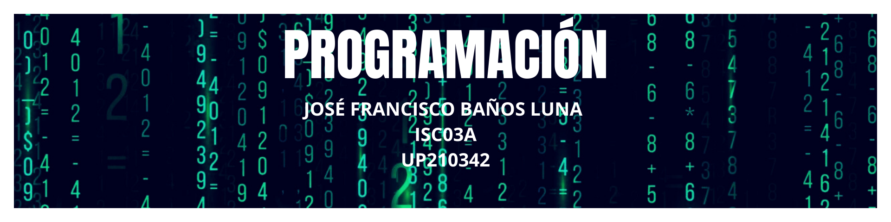

<table class="tg">
<thead>
  <tr>
    <th class="tg-c3ow">Unit</th>
    <th class="tg-c3ow">Name</th>
    <th class="tg-c3ow">Evidence</th>
    <th class="tg-c3ow">Alloted Percentage</th>
    <th class="tg-c3ow">Total</th>
  </tr>
</thead>
<tbody>
  <tr>
    <td class="tg-c3ow">U1</td>
    <td class="tg-c3ow">Programming introduction</td>
    <td class="tg-c3ow">U1EP1</td>
    <td class="tg-c3ow">100%</td>
    <td class="tg-c3ow">10%</td>
  </tr>
  <tr>
    <td class="tg-c3ow" rowspan="2">U2</td>
    <td class="tg-c3ow" rowspan="2">Control structures and cycles</td>
    <td class="tg-c3ow">U2EC1</td>
    <td class="tg-c3ow">50%</td>
    <td class="tg-c3ow" rowspan="2">30%</td>
  </tr>
  <tr>
    <td class="tg-c3ow">U2EP1</td>
    <td class="tg-c3ow">50%</td>
  </tr>
  <tr>
    <td class="tg-c3ow" rowspan="2">U3</td>
    <td class="tg-c3ow" rowspan="2">Functions</td>
    <td class="tg-c3ow">U3EC1</td>
    <td class="tg-c3ow">50%</td>
    <td class="tg-c3ow" rowspan="2">30%</td>
  </tr>
  <tr>
    <td class="tg-c3ow">U3EP1</td>
    <td class="tg-c3ow">50%</td>
  </tr>
   <tr>
    <td class="tg-c3ow" rowspan="2">U4</td>
    <td class="tg-c3ow" rowspan="2"> Files and arrays</td>
    <td class="tg-c3ow">U4EC1</td>
    <td class="tg-c3ow">50%</td>
    <td class="tg-c3ow" rowspan="2">30%</td>
  </tr>
  <tr>
    <td class="tg-c3ow">U4EP1</td>
    <td class="tg-c3ow">50%</td>
  </tr>
</tbody>
</table>

> **COMANDOS GITHUB:**

* Git status
* Git add .
* Git commit -m " "
* Git push

___

## **TABLA**
|Equipo padrisisisimo|UP      |
|--------------------|--------|
|Antoño              |UP210289|
|Pako                |UP210342|

___

