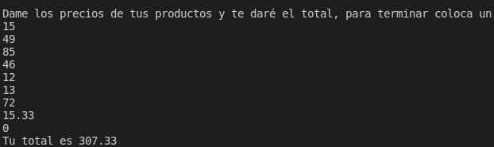

## ***UNIDAD 2:***  Control structures and cycles

<center>

> ### 1. IMPUESTO: 
> A program that asks the user their annual rent, and shows the tax that corresponds them.

</center>

 ___
 ```
#include <iostream>
using namespace std;

int main()
{
    int renta = 0;
    int imp= 0;
    cout <<"Dame tu renta anual para darte tu interés correspondiente \n";
    cout <<"\n";
    cin >> renta;
    if (renta <= 10000)
    {
        cout << "\n Tu impuesto correspondiente es de 5%";
    } else if (renta > 10000 && renta <= 20000)
    {
        cout << "'\n Tu impuesto correspondiente es de 10%";
    } else if (renta > 20000 && renta <= 35000)
    {
        cout << "\n Tu impuesto correspondiente es de 15%";
    } else if (renta > 35000 && renta <= 60000)
    {
        cout << "\n Tu impuesto correspondiente es de 20%";
    }else if (renta > 60000)
    {
        cout << "\n Tu impuesto correspondiente es de 45%";
    }
    return 0;
}


```
---

<center>

 *RESULT:*
---


---

> ### 2. PUNTAJE: 
> A program that asks the user their final score in the anual evaluation in the company they work at. Depending on the score, they´ll get a bonus of certain amount of money. 

</center>

 ___
 ```
#include<iostream>
#include<cmath>
#include<math.h>

using namespace std;

int main(int argc, char const *argv[])
{
    float p;
    int n;
    cout<< "Cual es tu puntuación?" <<endl; 
    cin>> p;

    if (p == 0.0f || p == 0.4f || p >= 0.6f)
    {
        if (p == 0.0f)
        {
            n = 2400 * 0.0f;
            cout << "Tu nivel es Inaceptable y recibirás " << n <<endl; 
        }
        else if (p == 0.4f)
        {
            n = 2400 * 0.4f; 
            cout << "Tu nivel es Aceptable y recibirás " << n <<endl; 
        }
        else if (p >= 0.6f)
        {
            n = 2400 * p;
            cout << "Tu nivel es Meritorio y recibirás " << n << endl; 
        }
    } else 
    {
        cout << "El valor que ingresaste no es válido" <<endl; 
    }
    
    return 0;
}


```
---

<center>

 *RESULTS:*
---


---


---


---

> ### 3. SALAJUEGOS: 
> A program that asks the user their age so it can give them the cost of entering the game area. 

</center>

 ___
 ```
#include <iostream>
using namespace std;

int main()
{
    int edad;
    char sn;
    do {
        cout << "Ingrese la edad del cliente \n";
        cin>>edad;
        if (edad<4)
        {
            cout<<"La entrada es gratis \n";
        }
        else if (edad<=18)
        {
            cout<<"La entrada cuesta $5 \n";
        }
        else
        {
            cout<<"La entrada cuesta $10 \n";
        }
        cout<<"¿Desea hacer otra consulta? (s/n)";
        cin>>sn;
    } while (sn=='s');   
    return 0;
}


```
---

<center>

 *RESULTS:*
---


---

> ### 4. PIZZA: 
> A program that asks the user if they´d like a vegetarian pizza or a non vegetarian, and what ingredients they´d like on them. 

</center>

 ___
 ```
#include<iostream>
using namespace std; 

int main()
{ 
    string ingr;
    string sabor = "Mozzarela, Tomate y "; 
    string extr; 
    cout << "Cómo quieres tu pizza: " <<endl; 
    cout << "- Vegetariana" <<endl; 
    cout << "- NoVegetariana" <<endl;
    cin >> ingr;
    if (ingr == "Vegetariana")
    {
        cout << "Elige tu ingrediente Vegetariano: " <<endl; 
        cout << "- Tofu" <<endl; 
        cout << "- Pimiento" <<endl;
        cin >> extr; 
        if (extr == "Tofu")
        {
            sabor = sabor + "Tofu"; 
        } else {
            sabor = sabor + "Pimiento";
        }
        cout << "Tu pizza es " << ingr << " con " << sabor <<endl;
    } else if (ingr == "NoVegetariana") {
    { 
        cout << "Elige tu ingrediente No Vegetariano: " <<endl; 
        cout << "- Peperoni" <<endl; 
        cout << "- Jamon" <<endl;
        cout << "- Salmon" <<endl;
        cin >> extr;
        if (extr == "Peperoni")
        {
            sabor = sabor + "Peperoni"; 
        } else 
        { if (extr == "Jamon")
        {
            sabor = sabor + "Jamon";
        } else 
        {
            sabor = sabor + "Salmon";
        }
        }
        cout << "Tu pizza es " << ingr << " con " << sabor <<endl;
    }
    }
    return 0;
}


```
---

<center>

 *RESULTS:*
---


---


---

> ### 5. TEMP: 
> A program that asks the user for 6 temperatures, and it´ll give the user the average, the biggest and the lowest temperature.

</center>

 ___
 ```
# include<iostream>
using namespace std;

int main()
{
    float sum = 0;
    float temp;
    float mayor = -254; 
    float menor = 254;
    cout << "Dame tus 6 temperaturas en kelvin y te diré el promedio, la menor y la mayor:" <<endl;
    for (int i = 0; i < 6; i++)
    {
        cin >> temp;
        if ( temp > mayor) 
        {
            mayor = temp;
        } 
        else if ( temp < menor)
        {
            menor = temp;
        }
        sum = sum + temp;
    }
    cout << "El promedio es " << sum/6 << ", la temperatura mayor es " << mayor << " y la menor es " << menor <<endl;
    return 0;
}


```
---

<center>

 *RESULT:*
---


---

> ### 6. PROD: 
> A program that asks the user for their shopping list, giving the program the prices to make the total, if the user is finished, hell insert a 0.

</center>

 ___
 ```
# include<iostream>
using namespace std;

int main()
{
    float prod; 
    float sum = 0; 
    cout << "Dame los precios de tus productos y te daré el total, para terminar coloca un 0" <<endl; 
    do 
    {
        cin >> prod; 
        sum = sum + prod;
    } while (prod != 0 );
    cout << "Tu total es " << sum <<endl;
}


```
---

<center>

 *RESULT:*
---




---


> ### 6. D2B: 
> A program that asks the user for a number in decimal, and converts it to binary.

</center>

 ___
 ```
#include<iostream>
#include<math.h>
using namespace std;

int main ()
{
    int n; 
    int s;
    char pr;
    string bin; 
    cout<<"Dame un número en decimal para convertirlo en binario"<<endl;
    cin >> n; 
    s = n;
    cout<<endl;
    for (int i = 8; i >= 1; i--)
    {
        if (n % 2 > 0)
        {
            bin= '1' + bin;
            n = n/2;
            floor(n);
        } else 
        { 
            bin = '0' + bin; 
            n=n/2;
            floor(n);
        }
    }
    cout <<endl<< s << " en binario es: "<< bin <<endl; 
return 0;
}


```
---

<center>

 *RESULT:*
---


---