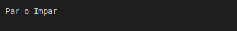
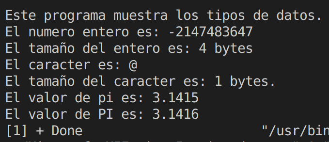
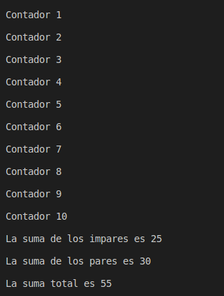
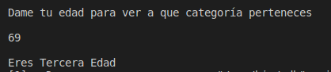

## ***UNIDAD 1:*** Programming introduction


<center>

> ### 1. Hola Mundo.cpp: 

</center>

 ___
 ```
#include <iostream>

using namespace std;  

int main(){
    cout<<"HolA Mundo"; 
    return 0;
}

```
---

<center>

 *RESULTADO:*
---


---

</center>

<center>

> ### 2. Parimpar.cpp: 

</center>

___
```
#include<iostream>
using namespace std;

int main()
{
    cout <<"Par o Impar" <<endl<<"\n" <<endl;
    return 0;
}

```
___

<center>

<center>

 *RESULTADO:*
---



---

</center>

> ### 3. Tipos de datos.cpp: 

</center>


___
```
#include <iostream> 
#include<stdio.h>

using namespace std;

int main()
{
    int entero= 3141615033;
    float flotante= 15.1919; 
    double grande= 1029384756;
    char caracter= '|'; 

    cout << "Este programa muestra los tipos de datos. \n"; 
    cout << "El numero entero es: " <<entero << endl;
    cout << "El tamaño del entero es: " <<sizeof(entero) <<"bytes" << endl; 
/*
    cout << "El numero flotante es: " <<flotante <<endl;
*/
getchar();
return 0; 
}

```
___

<center>

<center>

 *RESULTADO:*
---



---

</center>

> ### 4. Ciclos.cpp:
> 
</center>

___
```
#include <iostream>
using namespace std;

int main()
{
    int n = 10;
    int suma = 0;
    int par = 0;
    int impar = 0;
    int total = impar + par; 
    for (int i = 1; i <= n; i++)
    {
        printf(" Contador %d \n", i);
        printf("\n"); 
        suma = suma + i;
        if (i % 2 == 0)
        {
            par += i;
        }
        else
        {
            impar += i;
        }

    }
    total = impar + par; 
    printf(" La suma de los impares es %d \n", impar);
    printf("\n");
    printf(" La suma de los pares es %d \n", par);
    printf("\n");
    printf(" La suma total es %d \n", total);
    printf("\n");
    return 0;
}

```
---

<center>

 *RESULTADO:*
---



---
> ### 5. EDADES.cpp: 

</center>

___
```
#include <iostream>
using namespace std; 

int main()
{
    int e = 0;
    cout <<"Dame tu edad para ver a que categoría perteneces \n"; 
    cout <<"\n"; 
    cin >> e; 
    if (e >= 1 && e <= 30)
    {
        cout <<"\n"; 
        cout <<"Eres Primera Edad"; 
        cout <<"\n"; 
    }
    else 
    {
        if (e >= 31 && e<= 60)
        {
            cout <<"\n"; 
            cout <<"Eres Segunda Edad"; 
            cout <<"\n"; 
        }
        else 
        {
            if (e >= 61 && e <=90) 
            {
                cout <<"\n"; 
                cout <<"Eres Tercera Edad"; 
                cout <<"\n"; 
            }
            else 
            {
                cout <<"\n"; 
                cout <<"Eres Horas Extra";
                cout <<"\n"; 
            }
        }
    }
    return 0; 
}

```
___

<center>

 *RESULTADO:*
---



---